I currently work at [Société Générale](https://www.societegenerale.com/en) with ***3 main roles***: 
1. *Tech Architect & Advisor*,
1. *Chairman of the Cloud Architecture Committee*, and
1. *Open Source Advocate*

I used to be the *Product Owner of a [Cloud Innovation Platform](https://github.com/societe-generale/cloud-innovation-platform)* -- an open sourced platform our innov'actors use to qualify new technologies during pre-projects phases.

Find out more on my [LinkedIn profile](https://www.linkedin.com/in/plachance/)

 

